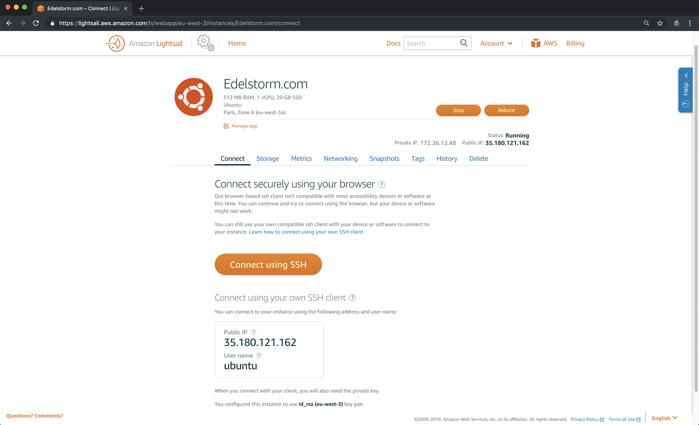
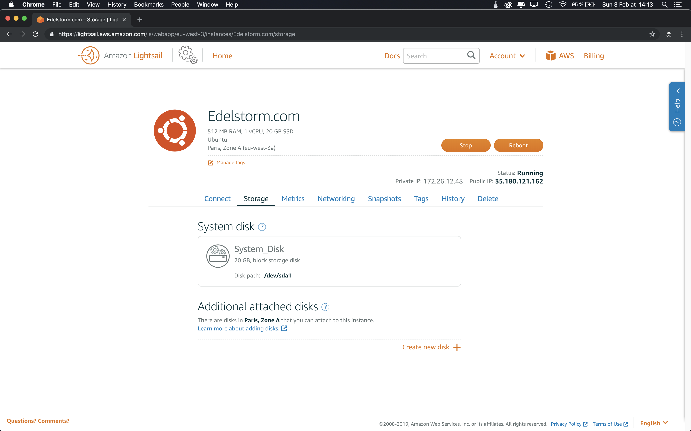
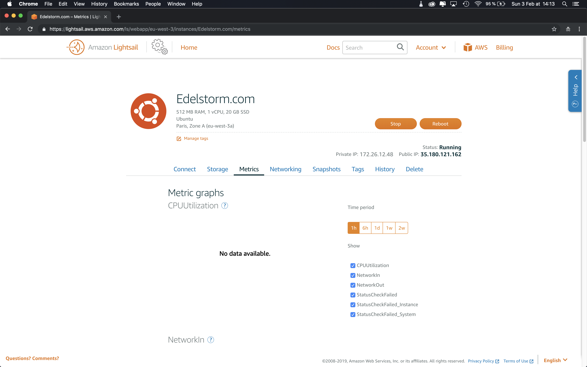
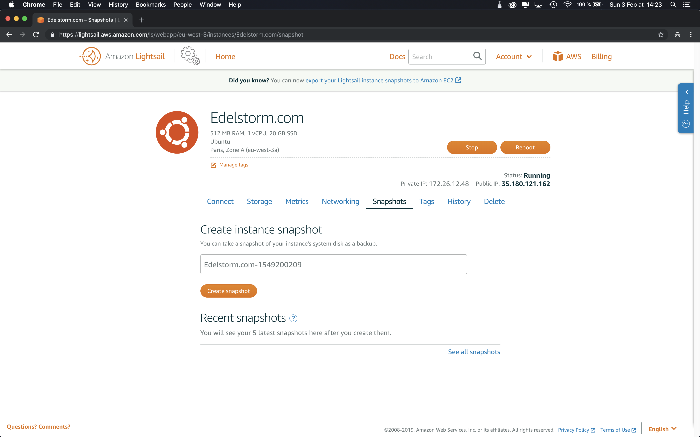
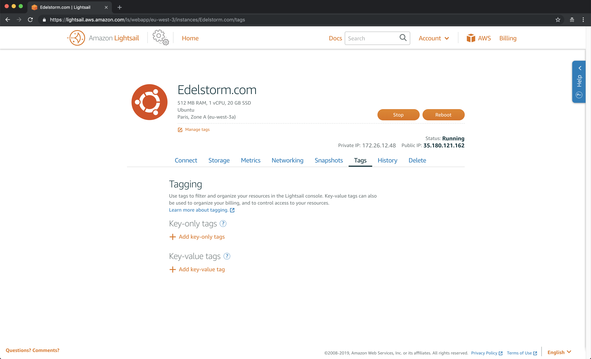
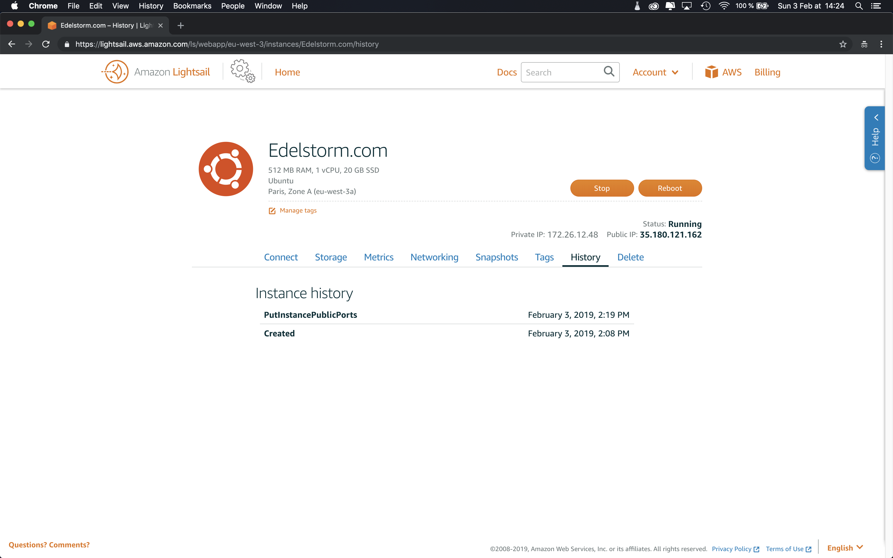
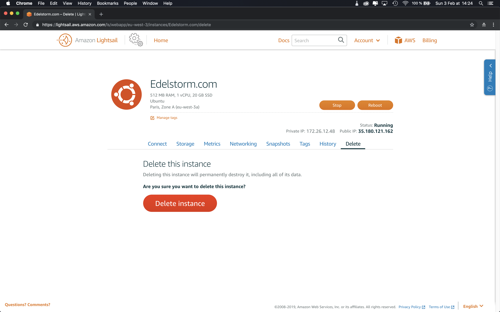

# Creation de l'instance <small>- Lightsail</small>

!!! info "Copier / coller facilement les commandes du tutoriel en cliquant sur l'icone de droite"

    ``` sh
    Copiez cette phrase pour tester
    ```

## Générer une paire de clés SSH

{==

**Améliorations nécessaires**<br> 
1) Sur cette étape, il faut faire deux GIF : première partie (génération de la clé SSH) et deuxième partie (localisation du dossier SSH)<br> 
2) Ralentis le tempo globale pour rentrer plus visible l'ensemble des opérations, teste x1.5<br> 

==}

[](assets/images/aws/creation-instance/en/1.gif)

***

**Sécurisation des communications entre votre machine et votre futur serveur**

:    * En haut à droite de votre écran, lancer une recherche Spotlight, tappez *Terminal* puis appuyez sur <kbd>Entrer</kbd>
:    * Une fois dans votre terminal, tappez cette commande et appuyez sur <kbd>Entrer</kbd>
``` sh
ssh-keygen -t rsa
```

:    * Vous pouvez ensuite nommer votre paire de clés, sinon appuyez juste sur <kbd>Entrer</kbd>

!!! note "À savoir"

    Un mot de passe que vous tappez dans le terminal ne s'affichera jamais sur votre écran.<br> 
    Vous devez donc le définir à l'aveugle !

:    * Définissez un mot de passe et appuyez sur <kbd>Entrer</kbd>
:    * Ressaisissez votre mot de passe et appuyez sur <kbd>Entrer</kbd>

***

**Localisation de votre paire de clés SSH**

:    * Ouvrez votre Finder, cliquez en haut sur **Aller** puis cliquez sur **Aller au dossier...**
:    * Dans la barre de recherche, tappez cette commande et appuyez sur <kbd>Entrer</kbd>
``` sh
~/.ssh
```

:    * Une fois dans le dossier {==.ssh==} faite glisser l'icon dossier en haut de la fenètre du Finder dans votre barre de favoris pour y accéder plus facilement par la suite.

!!! success "Votre machine a généré votre paire de clés SSH que vous pouvez facilement localisée à partir de son dossier !"

***

## Création de l'instance

[](assets/images/aws/creation-instance/en/2.gif)

***

**Création de votre instance Amazon Lightsail**

:    * Rendez-vous sur votre console d'administration AWS, tappez *Lightsail* dans la barre recherche et cliquez sur ce service.
:    * Selectionnez la langue que vous souhaitez pour votre interface.
:    * Cliquez sur {==Créer une instance==}

***

**Zone géographique, type d'image et connexion SSH**

:    * Choississez la région de votre instance, elle doit être au plus proche de vos futurs utilisateurs. Laissez par défaut la zone de votre instance.
:    * Choississez *Linux/Unix* comme plateforme.
:    * Selectionnez *Ubuntu 16.04 LTS* comme système d'exploitation.
:    * Téléchargez votre paire de clés SSH publique (avec l'extension `.pub`) afin de sécuriser les communications entre votre machine et cette instance.

***

[](assets/images/aws/creation-instance/en/3.gif)

***

**Plan d'instance et identification**

!!! info "Facturation AWS"

    À partir de cette étape vous souscrivez au service Amazon Lighsail, votre instance peut-être supprimée à tout moment si vous n'en avez plus besoin. Vous pouvez consulter l'évolution de votre <a href="https://console.aws.amazon.com/billing/home#/" target="_blank">facturation</a>.

:    * Sélectionnez le plan basique à **3.50$ par mois**, le premier mois d'essais est gratuit.
:    * Nommer votre instance de préférence avec votre nom de domaine.
:    * Vous pouvez aussi appliquer des tags d'identifications si vous comptez avoir de nombreuses instances par la suite.
:    * Cliquez sur {==Créer une instance==} et attendez 5 minutes que votre instance s'initialize.

!!! success "Votre instance est prête à être utiliser pour votre site web."

***

## Réglages du Firewall

[](assets/images/aws/creation-instance/en/11.gif)

***

**Ouverture des ports HTTPS & FTP**

:    * Cliquez sur votre instance et aller dans la section *Mise en réseau*
:    * Ouvrez les ports HTTPS et FTP (34210) pour sécuriser les communications entre vos utilisateurs, les applications externes et votre instance.
:    * Cliquez sur {==Sauvegarder==}

!!! success "Votre instance est correctement configurée pour la suite de ce tutoriel"

***

## IP Statique

{==

😭 Tu as oublié un GIF ici. Celui ou je clique sur Static IP pour le créer et l'attacher à l'instance.

==}

***

**Fixation de l'adresse IP de votre instance**

!!! info "IP dynamique et IP statique"

    Par défaut, votre instance à une adresse IP dynamique, c'est à dire qu'à chaque fois que vous là redémarrer, son adresse IP change. Pour que votre site web soit joignable depuis une addresse unique, il faut lié votre instance à une IP statique. Une IP statique est gratuit lorsqu'elle est attachée à une instance.

:    * Dans la section *Mise en réseau* de votre instance, cliquez sur *Attacher une IP Statique*.
:    * Selectionnez la même zone géographique que celle choisie pour votre instance.
:    * Attachez votre instance à cette IP statique.
:    * Nommez votre IP statique de cette façon : *StaticIp-VotreNomDeDomaine*
:    * Cliquez sur {==Créer==}

!!! success "Votre instance possède une adresse IP unique !"

***

## Zone DNS

[](assets/images/aws/creation-instance/en/12.gif)

***

**Association de votre instance à votre nom de domaine**

:    * Cliquez sur *Accueil* en haut de votre interface Lightsail et aller dans l'onglet *Mise en réseau*.
:    * Cliquez sur {==Créer une zone DNS==}
:    * Dans le champs, spécifiez votre nom de domaine.
:    * Vous pouvez associer des tags d'identifications à cette zone DNS.
:    * Cliquez sur {==Créer une zone DNS==}

!!! success "Votre instance possède une zone DNS !"

***

[](assets/images/aws/creation-instance/en/13.gif)

***

**Création des enregistrements pour votre zone DNS**

:    * Cliquez sur *Ajouter un enregistrement*.
:    * Ajoutez un premier enregistrement de type A pour `@.VotreNomDeDomaine.com` pointant vers votre IP statique.
:    * Ajoutez un second enregistrement de type A pour `www.VotreNomDeDomaine.com` pointant vers votre IP statique.
:    * Observez en dessous vos nouveaux serveurs de nom pour cette zone DNS. Et copiez le premier.

!!! success "L'IP statique de votre instance pointe vers votre nom de domaine !"

***

[](assets/images/aws/creation-instance/en/14.gif)

***

**Injection des nouveaux serveurs de nom pour votre nom de domaine**

:    * Ouvrez un nouvel onglet sur votre console d'administration AWS. Vous pouvez facilement y accéder en cliquant sur *AWS* en haut à droite de votre interface Lightsail.
:    * Cherchez le service *Route 53* dans la barre de recherche et cliquez dessus.
:    * Sur la gauche de l'interface cliquez sur *Domaines enregistrés*.
:    * Cliquez sur votre nom de domaine.
:    * Sur la droite de l'interface, injectez un à un les quatres nouveaux serveurs de noms de votre zone DNS.
:    * Cliquez sur {==Mettre à jour==}

!!! success "Les serveurs de noms de votre zone DNS sont ceux de votre nom de domaine !"

***

## Options de l'instance

!!! info "Tour d'horizon"

    Vous venez de créer votre première instance, en cliquant sur son nom depuis l'Accueil vous découvrirez de nombreuses options que nous allons vous présenter ci-dessous.

[](assets/images/aws/creation-instance/en/4.png)

***

**Connexion SSH depuis votre navigateur**

:    * Dans l'onglet *Connexion*, en cliquant sur *Se connecter à l'aide de SSH* vous pourrez accéder en mode sécurisé au terminal de votre serveur à distance.
:    * Vous pouvez choisir de vous connectez, d'arrêtez, de redémarrez et de supprimer cette instance.
:    * Vous observez votre IP statique et votre nom d'utilisateur si vous souhaitez vous connectez en SSH directement avec le terminal de votre ordinateur.

***

[](assets/images/aws/creation-instance/en/5.png)

***

**Stockage évolutif**

:    * Dans l'onglet *Stockage*, avec le plan à 3.50$ par mois vous bénéficiez de 20Go de stockage sur cette instance. Ce qui est largement suffisant pour vos besoins actuels.
:    * Si vous avez besoin de plus d'espace de stockage vous pouvez ajouter des disques supplémentaires à cette instance. L'ajout de nouveaux disques est une fonction payante.

***

[](assets/images/aws/creation-instance/en/6.png)

***

**Métriques**

:    * Dans l'onglet *Métriques*, vous pouvez obtenir les statistiques d'usage de votre instance.

***

[](assets/images/aws/creation-instance/en/7.png)

***

**Snapshots**

:    * L'onglet *Snapshots* est une fonctionnalité trés importante sur laquelle nous reviendrons par la suite. Un snapshot vous permet de sauvegarder la totalité de votre instance à un instant T pour éviter les erreurs que vous pouvez faire dans le futur.

***

[](assets/images/aws/creation-instance/en/8.png)

***

**Tags**

:    * Vous pouvez ajouter des tags à votre instance pour l'identifier plus facilement si vous en avez plusieurs.

***

[](assets/images/aws/creation-instance/en/9.png)

***

**Historique**

:    * Vous pouvez consulter l'historique pour consulter vos dernières actions sur cette instance.

***

[](assets/images/aws/creation-instance/en/10.png)

***

**Suppression**

:    * À tout moment vous pouvez supprimer votre instance depuis cette onglet.

***

!!! success "Félicitation votre instance est configurée pour votre site web !"