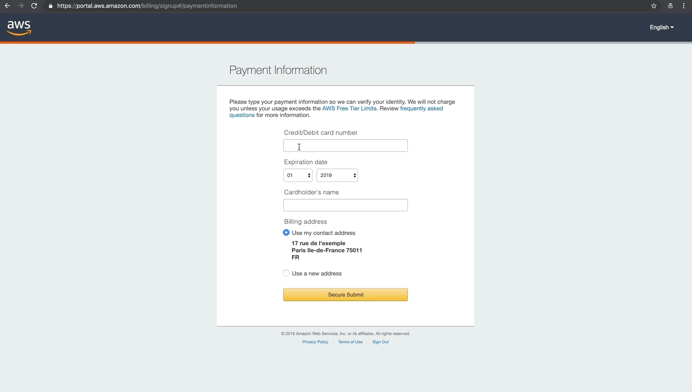
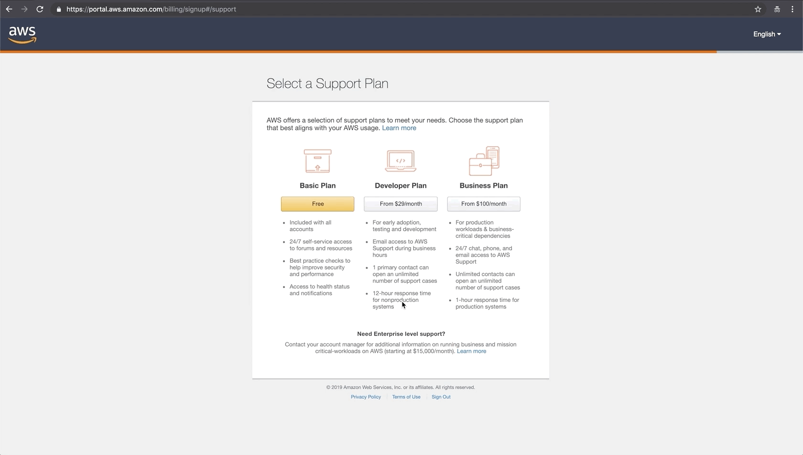

# Création du compte <small>- AWS</small>

!!! tip "Conseil"
    Chaque étape sera accompagnée d’une image ou d’une animation, n’hésitez pas à vous aider des instructions !

## Identifiants

***

Rendez-vous sur le site web d'<a href="https://portal.aws.amazon.com/billing/signup#/start" target="_blank">Amazon Web Services</a>.

***

***

**Remplissez les champs du formulaire de création du compte :**

:    * Renseignez une adresse e-mail valide à laquelle vous avez un accès régulier.
:    * Créer un mot de passe fort contenant au moins 8 caractères, une majuscule, un chiffre et un symbole non-alphanumérique tel que <kbd>!</kbd> <kbd>@</kbd> <kbd>#</kbd> <kbd>(</kbd> <kbd>?</kbd>
:    * Renseignez votre mot de passe une deuxième fois pour vérifier que vous l’avez correctement écrit.
:    * Définissez un identifiant pour votre compte AWS. Cela peut être votre nom, de votre entreprise ou celui de votre futur site web.

***

## Contact

***

**Remplissez les champs du formulaire de contact pour votre facturation AWS :**

:    * Choisissez votre type de compte.
:    * Entrez votre nom et votre prénom.
:    * Entrez votre numéro de téléphone avec l’indicatif de votre pays (+33 pour la France).
:    * Sélectionnez votre pays.
:    * Entrez votre adresse, votre ville, votre région et votre code postal.
:    * Cochez la case pour accepter votre <a href="https://aws.amazon.com/fr/agreement/" target="_blank">contrat client</a>.
:    * Cliquez sur {==*Créer un compte et continuer*==}

***

## Paiement

!!! info "À savoir sur l'offre AWS"

    1. L'ouverture de votre compte AWS est gratuite, le coût est fait à l'utilisation des différents services.
    2. Le premier mois d’utilisation de l'instance qui supportera votre futur site web est offert.
    3. Vous aurez besoin d'acheter votre nom de domaine pour mener à bien cette formation.
    4. Vous pouvez facilement consulter les détails de votre <a href="https://console.aws.amazon.com/billing/home#/" target="_blank">facturation</a>.
    5. Vous pouvez à tout moment quitter AWS sans aucuns côuts additionnels.

***

**Remplissez les champs du formulaire avec vos informations bancaires :**

:    * Entrez votre numéro de carte de crédit.
:    * Entrez sa date d'expiration.
:    * Entrez le nom et le prénom du détenteur de la carte.
:    * Selectionner votre adresse de facturation.
:    * Soumettez ces informations de manière sécuriser en cliquant sur {==*Secure Submit*==}

***

## Vérification

!!! warning "Valider son numéro"

    1. Tenez-vous à proximité de votre téléphone, le service automatisé d'AWS va vous contactez directement.
    2. Saississez la suite de quatre chiffres qui s'affiche sur votre écran sur le clavier numérique de votre téléphone.

***

**Vérifier votre numéro de téléphone :**

Sur cette étape AWS va vérifier que vous êtes bien une véritable personne et non un robot.

:    * Sélectionnez votre pays et renseignez votre numéro de téléphone.
:    * Complétez le Captcha de sécurité en reproduisant la suite de lettres et de chiffres que vous voyez à l’écran.
:    * Cliquez sur {==*Contact me*==}

***

### Appel d'AWS

***

**Vous allez recevoir un appel d’AWS**

Saississez sur votre téléphone les quatres chiffres qui s'affichent sur votre l'écran.

***

### Confirmation

***

**Attendez un instant...**

L’opération sera réussie ce message de confirmation s’affiche à l’écran. 
Vous pouvez raccrocher et cliquer sur {==Continuer==}

***

!!! warning "Incident possible"

    Si pour une raison ou une autre vous raccrochez avant d’avoir pu entrer le code ou que le réseau se coupe, gardez la page ouverte. Après quelques minutes, AWS détectera un problème et vous demandera de recommencer l’opération. Vous n’aurez qu’à cliquer sur le bouton {==Recommencer==}

## Basic Plan

***

**Vous êtes désormais sur la page qui présente des différentes offres de support**

:    * Choisissez la première offre *Basic Plan* en cliquant sur {==Free==}
:    * Puis cliquez sur {==Sign in to the Console==}

***

## Connexion

***

**Vous pouvez à présent vous connectez à votre compte AWS**

:    * Saississez l'addresse e-mail de votre compte puis cliquez sur {==Suivant==}
:    * Saississez le mot de passe de votre compte, cliquez sur {==Connexion==}

***

## Console

!!! success "Bienvenue sur la console d'administration d'Amazon Web Services !"
    N'oubliez pas de cliquer sur le lien de vérification envoyé par AWS dans votre boîte mail pour vérifier votre addresse!