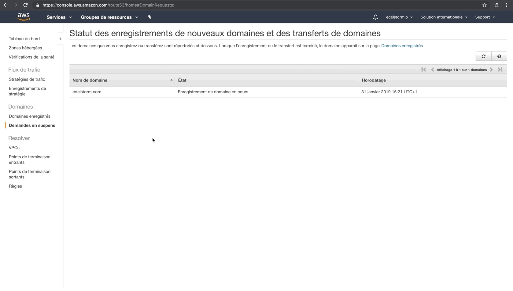
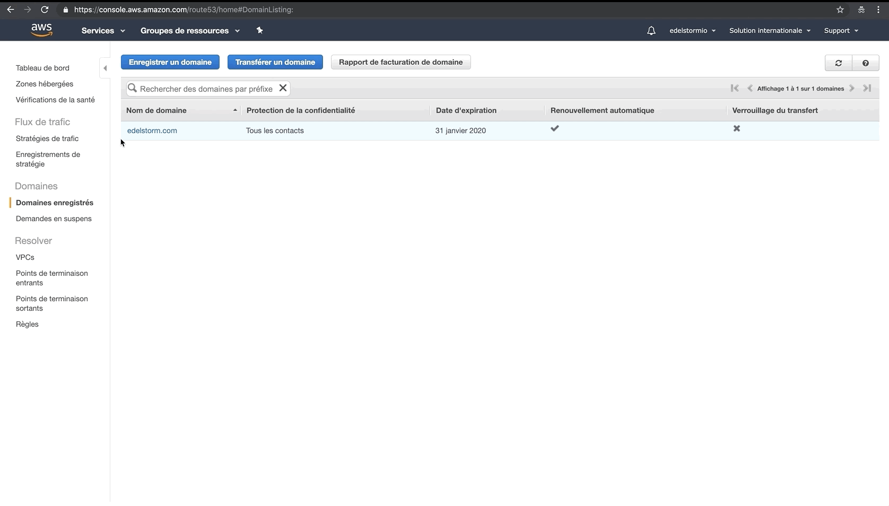

# Nom de domaine - <small>AWS</small>

## Route 53

***

**Système de noms de domaine (DNS) dans le cloud hautement disponible et évolutif <a href="https://aws.amazon.com/fr/route53/" target="_blank">&#185;</a>**

:    * En haut à doite de la console, sélectionnez votre zone géographique.
:    * Puis dans la zone de recherche, cherchez {==*Route 53*==} et cliquez dessus.
:    * Choississez l'option de droite {==*Enregistrer un nom de domaine*==}

***

## Choix du nom de domaine

***

**Testez la disponibilité du nom de domaine que vous souhaitez**

:    * Tappez le nom de domaine et l'extension de votre futur site web.
:    * Une fois votre choix fait selon les disponibilités, cliquez sur {==*Continuer*==}

***

## Détails de contact

***

**Completez le formulaire de contact pour votre nom de domaine**

:    * Activez la protection de la confidentialité
:    * Cliquez sur {==*Continuer*==}

***

## Vérifications

***

**Vérifiez vos informations**

:    * Cocher la case pour accepter votre contact d'enregistrement de nom de domaine AWS.
:    * Cliquez sur {==*Terminer l'achat*==}

***

## Statut d'enregistrement

***

**Patientez le temps qu'AWS enregistre votre nom de domaine**

:    * Un enregistrement prends généralement 10 minutes.
:    * Cliquez sur {==*Domaine enregistré*==} pour vérifier si l'enregistrement est réussi.

***

## Zones hébergées

***

**Supprimer votre zone hébergée par défaut**

:    * Cliquez sur {==*Zones hébergées*==}
:    * La suppression de votre zone hebergée par défaut permettra par la suite à votre future server web de prendre le relais.

***

!!! success "Félication, l'enregistrement de votre nom de domaine est un succès !"
    Nous reviendrons une dernière fois sur cette interface un peu plus tard, garder cette page ouverte!
