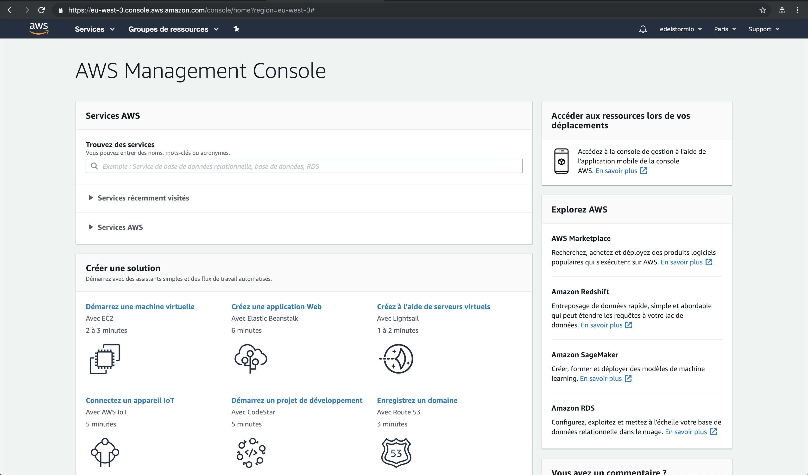
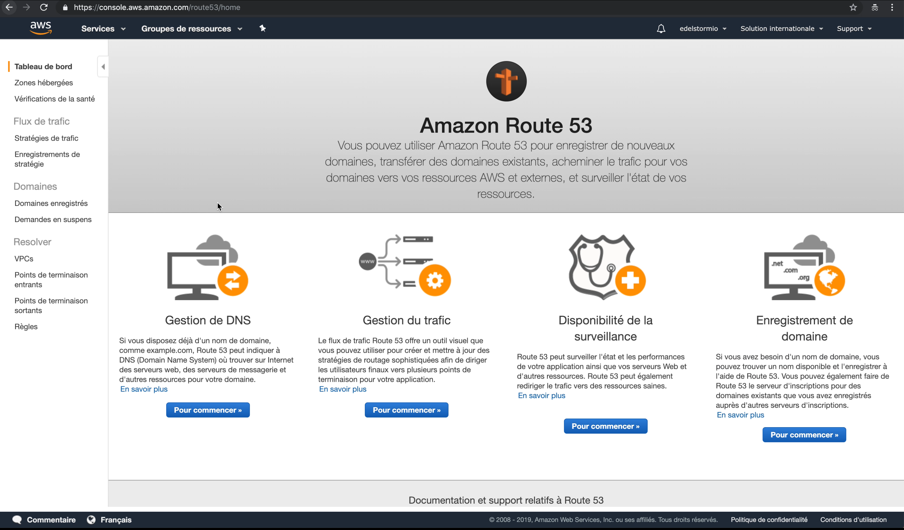
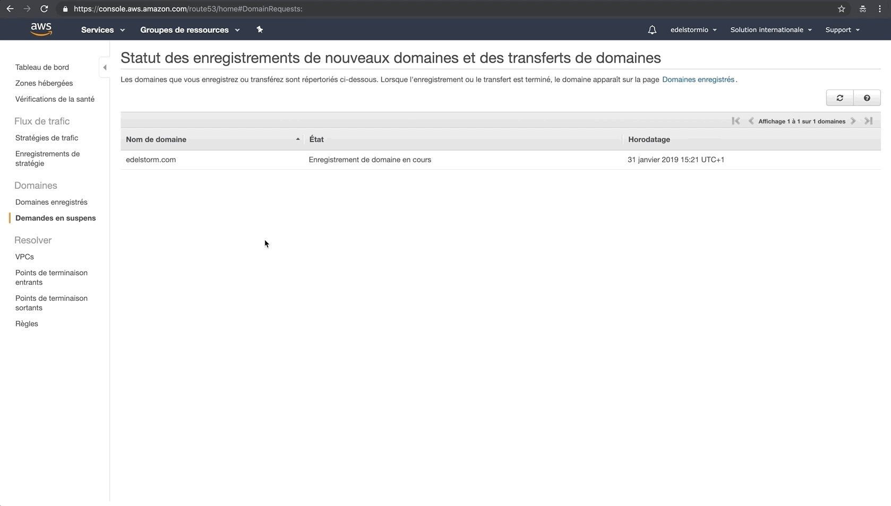

# Achat de votre nom de domaine <small>- AWS</small>

## Route 53

Vous êtes sur votre compte AWS. Si vous avez fermez la fenêtre suivez [ce lien][1].
[1]: https://console.aws.amazon.com/console/home
[new tab]: https://console.aws.amazon.com/console/home

